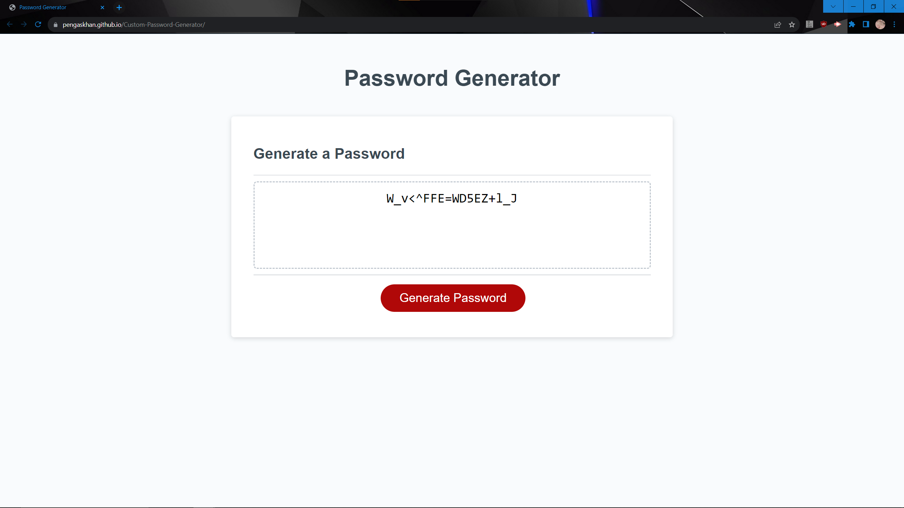

# Custom-Password-Generator

Challenge 3 submission by Connor Ness

Writing a function that will generate a password based on given criteria, and output the result onto a dynamic HTML page.

[Link to live page](https://pengaskhan.github.io/Custom-Password-Generator/)

)